# LDPC decoder: persistent context, min-sum / table sum-product, iteration budget, calibrated LLRs

**Status:** design record for the `ldpc-decoder` change set, 2026-10-08
**Author:** Joseph Freivald
**Scope:** receiver only, no wire change; every existing caller of
`run_ldpc_decoder()`, `encode()`, `ldpc_decode_frame()`, `symbols_to_llrs()`
compiles and behaves as before unless it opts in.

## Why

Measured against MATLAB belief propagation (Communications Toolbox) on all
seven data-mode codes, BPSK/AWGN, 600 frames per point (`tests/matlab/TestLdpc.m`):

| code (modes) | 10-iteration cap loss, FER 1e-1 | fixed-EsNo LLR scale loss | both, FER 1e-2 |
|---|---|---|---|
| HRA_56_56 (DATAC14) | 0.30 dB | 0.14 dB | floor |
| H_128_256_5 (DATAC0) | 0.33 | 0.29 | 0.71 |
| H_256_512_4 (DATAC13) | 0.55 | 0.20 | 0.68 |
| H_256_768_22 (DATAC15/16) | 0.93 | 0.58 | 1.77 |
| H_1024_2048_4f (DATAC3/4) | 0.87 | 0.30 | 1.20 |
| H_4096_8192_3d (DATAC1) | 1.27 | 0.38 | 1.84 |
| H_16200_9720 (DATAC17/QAM16C2) | 1.19 | n/a | 1.60 |

The SumProduct implementation itself is correct (at 50 iterations it tracks
MATLAB within 0.04 dB on every code).  The loss comes from `max_iter = 10`
("limit CPU load", `freedv_700.c`) and from scaling LLRs with the per-mode
constant `EsNodB`.  The CPU concern is real on small boards but was being paid
in the wrong place: the decoder rebuilt its graph with one heap allocation per
node on every call (about 22,700 allocations and 1.9 MB churn per 16200-bit
decode), visited every edge through two pointer indirections, and called the
transcendental `phi0()` twice per edge per iteration; `-O3` changed nothing
because it is memory-bound.  It also tested parity on the extrinsic message
signs instead of the hard decisions, so it kept iterating after it had found
the codeword and reported a pessimistic parity count.

## What changes

`modem/freedv/ldpc_ctx.{c,h}` (new): a persistent context per `struct LDPC`.
The Tanner graph is built once in a structure-of-arrays layout: rows sorted
by degree and packed eight to a block with slots interleaved so vector lanes
are rows; CSR in both directions; messages per slot; a per-slot hard-bit
array so the parity check is a streaming XOR.  Zero allocations in the decode
path (ASan/UBSan clean).  Four algorithms share the layout:

| algorithm | what | when |
|---|---|---|
| `sp` | phi-domain sum-product with the original `phi0()` | result-equivalent to legacy, A/B reference |
| `spt` | sum-product with a two-segment interpolated phi table, no call per edge | default on H_1024_2048_4f and H_16200_9720 |
| `nms` | normalised min-sum, float | reference for `nms16` |
| `nms16` | normalised min-sum, int16 1/16-LLR fixed point, check pass in 8-lane 128-bit vectors (compiler vector extensions: SSE2 on x86-64, NEON on arm64/armv7) | default on the other five codes |

Per-code policy and min-sum scale come from a MATLAB sweep against BP@50
(0.85 for H_256_768_22 and H_4096_8192_3d where it equals or beats BP, 0.70
and 0.80 where min-sum still trails BP by 0.1-0.4 dB and `spt` is used).
`LDPC_ALG=auto|sp|spt|nms|nms16|legacy` or `ldpc_set_default_alg()` select.

`run_ldpc_decoder()` is unchanged in signature: it lazily creates the context
(new trailing `ctx` field in `struct LDPC`), honours `ldpc->deadline_ns` and
fills `ldpc->last_stats` / `decode_count`.  `run_ldpc_decoder_ex()` takes an
explicit monotonic deadline and returns `ldpc_stats_t` (iterations, parity
count, parity ok, deadline hit).  `run_ldpc_decoder_legacy()` keeps the old
code for comparison.

FreeDV API: `freedv_set_ldpc_budget_ms()`, `freedv_set_ldpc_max_iter()`,
`freedv_get_ldpc_stats()`, `freedv_set_llr_calibrated()`,
`freedv_get_llr_esno_db()`.  `max_iter` default 100 (`LDPC_MAX_ITER_DEFAULT`).

Mercury: `modem.c` derives each pooled mode's budget as
min(`budget_guard_frac` x ARQ channel guard, `budget_air_frac` x frame
airtime), defaults 0.5 and 0.25 (350 ms today, guard-limited), passes it to
the backend (`set_ldpc_budget` / `get_ldpc_stats` vtable hooks), accumulates
decodes, mean iterations, deadline hits and parity failures per mode, logs
them at shutdown and publishes `ldpc_iters_last`, `ldpc_iters_mean`,
`ldpc_deadline_hits`, `ldpc_max_iter` on the status JSON.  `[ldpc]` in
`mercury.ini` (`max_iter`, `budget_ms`, `budget_guard_frac`,
`budget_air_frac`, `alg`).  `mercury -B` times every code and algorithm on the
host.

Demapper (`mpdecode_core.c`): `llr_from_qam()` is a generic max-log demapper
over any constellation table with per-symbol amplitude and an Es/No scale;
`qam_constellations.h` holds MATLAB-generated unit-power tables for 32
(cross), 64, 128 (cross) and 256-QAM; `symbols_to_llrs()` and
`psk_modulate_frame()` accept 5-8 bits per symbol, the QPSK and 16-QAM paths
are untouched.  LLR scale: per packet, the receiver's Es/No estimate is passed
through the existing per-mode SNR calibration (`freedv_snr_calib`) and mapped
back from SNR3k to Es/No by subtracting the bandwidth + cyclic-prefix term,
clamped to -3..20 dB; `freedv_set_llr_calibrated(0)` restores the constant.
HARQ Chase combining sums calibrated LLRs (the average was a workaround for
the uncalibrated scale and is kept for that case).  The "decoded information
bits all zero" early exit of the old loop (a test hook fed a zero reference
vector in production) is gone.

## Measured

Per iteration, Apple M5 Pro, cliff fixtures (`tests/matlab/fixtures/llr`):

| code | legacy us/iter | spt | nms16 | policy | ms per frame at 50 it., legacy -> policy |
|---|---|---|---|---|---|
| H_256_768_22 | 29-34 | 11.2 | 3.8 | nms16 | 0.70 -> 0.05 |
| H_1024_2048_4f | 86-90 | 34.7 | 9.7 | spt | 2.4 -> 0.59 |
| H_4096_8192_3d | 304-312 | 101 | 30 | nms16 | 10.1 -> 0.78 |
| H_16200_9720 | 668-678 | 290 | 114 | spt | 26.3 -> 9.0 |

Working memory per code, old transient per call -> new persistent: 68 KB ->
19 KB (768), 244 -> 70 (2048), 778 -> 221 (8192), 1,927 -> 554 (16200)
(float message buffers; the int16 path uses less).

MATLAB gates (`tests/matlab`, all passing): context `sp` vs legacy 0.00 dB
on every code; `spt` vs `sp` within 0.04 dB; `nms16` vs float `nms` within
0.04 dB; `nms` immune to the LLR scale (0.00 dB); max-log demapper vs MATLAB
approximate-LLR demodulator, relative error 2e-7 for 2-8 bits per symbol;
fixed-EsNo scale cost at the real modulation 0.19 dB (DATAC15/16, QPSK),
0.05 dB (DATAC1, QPSK), 0.42 dB (QAM16C2, 16-QAM; 0.38 dB at FER 1e-2).

Unit tests: `tests/modem/test_ldpc_ctx.c` (graph, legacy equivalence on the
shipped vector, min-sum, one-iteration clean decode, deadline, wrapper
lifecycle, struct-path deadline and stats), `tests/modem/test_llr_qam.c`
(tables, sign correctness, Somap agreement, high-order modulate/demap
round trip); `tests/modem/test_freedv_harq.c` unchanged and passing.


## Figures

Generated from the committed curves in `docs/ldpc-figures/data/` by
`tests/matlab/plot_ldpc_figures.m` (MATLAB R2026a).  Every waterfall is
600 frames per point, BPSK over AWGN, exact LLRs unless stated.

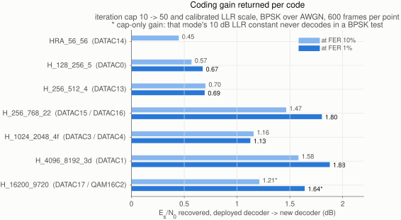

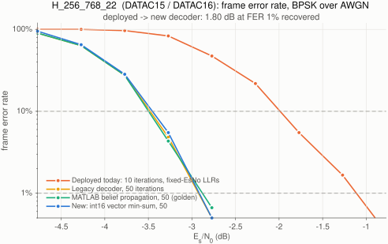
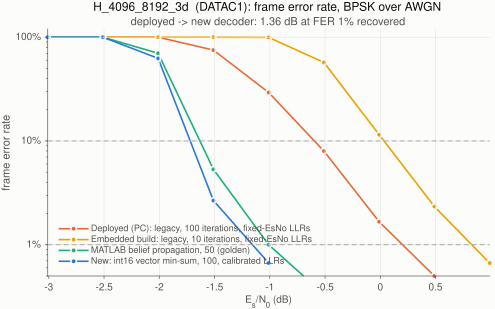
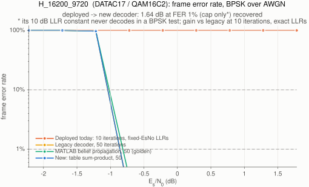
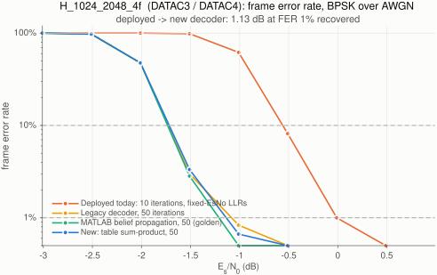
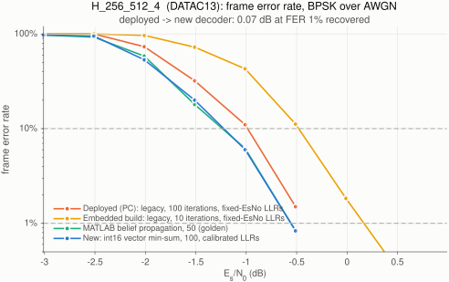
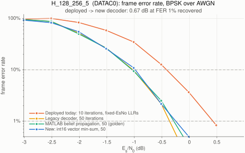
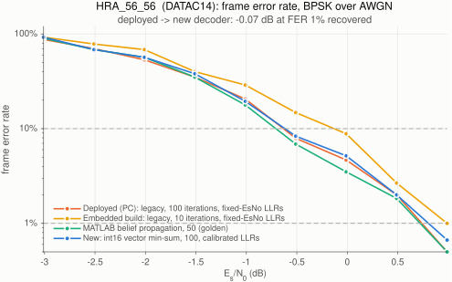

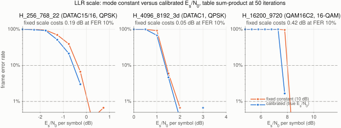
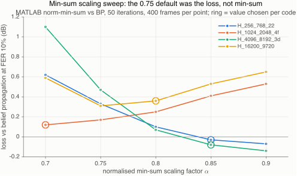
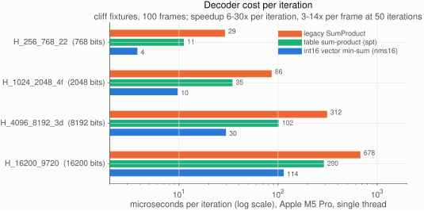
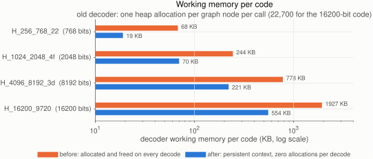

## Running it

```sh
make && make -C tests test_ldpc_ctx test_llr_qam test_freedv_harq && ./tests/test_ldpc_ctx
./mercury -B                              # ns per iteration per code on this host
make -C utils/golden all export           # exporter, ldpc_bench, llr_bench; writes tests/matlab/fixtures
# MATLAB R2026a + Communications Toolbox:
#   cd tests/matlab; run_all
```

## Follow-ups (not in this change)

Offset min-sum per code now that the LLR scale is calibrated (0.4 offset
beats BP on the two codes where min-sum trails); layered scheduling (half the
iterations); fold the MFSK backend's own min-sum decoder into this context;
VOLK for the OFDM acquisition correlators and the resampler, which are the
remaining Pi 4 CPU cost; higher-rate / rate-compatible codes for the 32-256
QAM modes the demapper now supports.
