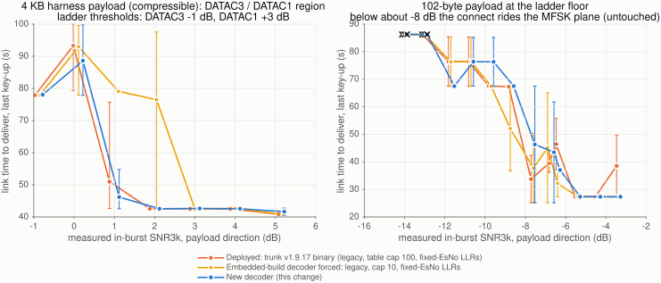

# LDPC decoder: persistent context, min-sum / table sum-product, iteration budget, calibrated LLRs

**Status:** design record for the `ldpc-decoder` change set, 2026-10-08
**Author:** Joseph Freivald
**Scope:** receiver only, no wire change; every existing caller of
`run_ldpc_decoder()`, `encode()`, `ldpc_decode_frame()`, `symbols_to_llrs()`
compiles and behaves as before unless it opts in.

## Why

Measured against MATLAB belief propagation (Communications Toolbox) on all
seven data-mode codes, BPSK/AWGN, 600 frames per point (`tests/matlab/TestLdpc.m`).
"Deployed" is what a desktop Mercury runs: codec2's SumProduct at the code
tables' limit of 100 iterations with LLRs scaled by the per-mode constant
`EsNodB` (3 dB, 10 dB for the 16200-bit code).  The 10-iteration cap in
`freedv_700.c` ("limit CPU load") is under `#ifdef __EMBEDDED__` and applies
only to embedded builds; its extra cost is the last column.

| code (modes) | deployed -> new, FER 1e-1 | FER 1e-2 | of which LLR scale | embedded build (cap 10), FER 1e-1 |
|---|---|---|---|---|
| HRA_56_56 (DATAC14) | 0.0 dB | 0.0 | 0.07 | 0.49 |
| H_128_256_5 (DATAC0) | 0.15 | 0.25 | 0.16 | 0.57 |
| H_256_512_4 (DATAC13) | 0.23 | 0.07 | 0.21 | 0.74 |
| H_256_768_22 (DATAC15/16) | **1.00** | **1.53** | 0.99 | 1.50 |
| H_1024_2048_4f (DATAC3/4) | 0.68 | 0.59 | 0.67 | 1.18 |
| H_4096_8192_3d (DATAC1) | **1.12** | **1.36** | 1.07 | 1.75 |
| H_16200_9720 (DATAC17/QAM16C2) | n/a in BPSK (its 10 dB constant never decodes; equal to legacy given exact LLRs) | | 0.42 at 16-QAM, from `llr_scale_cost` | 1.21 |

The SumProduct implementation itself is correct (at 50 iterations with exact
LLRs it tracks MATLAB within 0.04 dB on every code).  On a desktop the loss is
the LLR scale: the fixed `EsNodB` is right at one operating point only, and a
sum-product decoder fed over-confident LLRs converges to the wrong codeword
rather than slowly, so more iterations do not recover it (the "of which"
column is the whole gain on every code).  It costs 0.6-1.5 dB at FER 1e-2 on
the four codes that carry the ARQ ladder.  On an embedded build the cap adds
another 0.5 dB.

The CPU concern behind that cap is real on small boards but was being paid
in the wrong place: the decoder rebuilt its graph with one heap allocation per
node on every call (about 22,700 allocations and 1.9 MB churn per 16200-bit
decode), visited every edge through two pointer indirections, and called the
transcendental `phi0()` twice per edge per iteration; `-O3` changed nothing
because it is memory-bound.  It also tested parity on the extrinsic message
signs instead of the hard decisions, so it kept iterating after it had found
the codeword and reported a pessimistic parity count.

## What changes

`modem/freedv/ldpc_ctx.{c,h}` (new): a persistent context per `struct LDPC`.
The Tanner graph is built once in a structure-of-arrays layout: rows sorted
by degree and packed eight to a block with slots interleaved so vector lanes
are rows; CSR in both directions; messages per slot; a per-slot hard-bit
array so the parity check is a streaming XOR.  Zero allocations in the decode
path (ASan/UBSan clean).  Four algorithms share the layout:

| algorithm | what | when |
|---|---|---|
| `sp` | phi-domain sum-product with the original `phi0()` | result-equivalent to legacy, A/B reference |
| `spt` | sum-product with a two-segment interpolated phi table, no call per edge | default on H_1024_2048_4f and H_16200_9720 |
| `nms` | normalised min-sum, float | reference for `nms16` |
| `nms16` | normalised min-sum, int16 1/16-LLR fixed point, check pass in 8-lane 128-bit vectors (compiler vector extensions: SSE2 on x86-64, NEON on arm64/armv7) | default on the other five codes |

Per-code policy and min-sum scale come from a MATLAB sweep against BP@50
(0.85 for H_256_768_22 and H_4096_8192_3d where it equals or beats BP, 0.70
and 0.80 where min-sum still trails BP by 0.1-0.4 dB and `spt` is used).
`LDPC_ALG=auto|sp|spt|nms|nms16|legacy` or `ldpc_set_default_alg()` select.

`run_ldpc_decoder()` is unchanged in signature: it lazily creates the context
(new trailing `ctx` field in `struct LDPC`), honours `ldpc->deadline_ns` and
fills `ldpc->last_stats` / `decode_count`.  `run_ldpc_decoder_ex()` takes an
explicit monotonic deadline and returns `ldpc_stats_t` (iterations, parity
count, parity ok, deadline hit).  `run_ldpc_decoder_legacy()` keeps the old
code for comparison.

FreeDV API: `freedv_set_ldpc_budget_ms()`, `freedv_set_ldpc_max_iter()`,
`freedv_get_ldpc_stats()`, `freedv_set_llr_calibrated()`,
`freedv_get_llr_esno_db()`.  `max_iter` default 100 (`LDPC_MAX_ITER_DEFAULT`).

Mercury: `modem.c` derives each pooled mode's budget as
min(`budget_guard_frac` x ARQ channel guard, `budget_air_frac` x frame
airtime), defaults 0.5 and 0.25 (350 ms today, guard-limited), passes it to
the backend (`set_ldpc_budget` / `get_ldpc_stats` vtable hooks), accumulates
decodes, mean iterations, deadline hits and parity failures per mode, logs
them at shutdown and publishes `ldpc_iters_last`, `ldpc_iters_mean`,
`ldpc_deadline_hits`, `ldpc_max_iter` on the status JSON.  `[ldpc]` in
`mercury.ini` (`max_iter`, `budget_ms`, `budget_guard_frac`,
`budget_air_frac`, `alg`).  `mercury -B` times every code and algorithm on the
host.

Demapper (`mpdecode_core.c`): `llr_from_qam()` is a generic max-log demapper
over any constellation table with per-symbol amplitude and an Es/No scale;
`qam_constellations.h` holds MATLAB-generated unit-power tables for 32
(cross), 64, 128 (cross) and 256-QAM; `symbols_to_llrs()` and
`psk_modulate_frame()` accept 5-8 bits per symbol, the QPSK and 16-QAM paths
are untouched.  LLR scale: per packet, the receiver's Es/No estimate is passed
through the existing per-mode SNR calibration (`freedv_snr_calib`) and mapped
back from SNR3k to Es/No by subtracting the bandwidth + cyclic-prefix term,
clamped to -3..20 dB; `freedv_set_llr_calibrated(0)` restores the constant.
HARQ Chase combining sums calibrated LLRs (the average was a workaround for
the uncalibrated scale and is kept for that case).  The "decoded information
bits all zero" early exit of the old loop (a test hook fed a zero reference
vector in production) is gone.

## Measured

Per iteration, Apple M5 Pro, cliff fixtures (`tests/matlab/fixtures/llr`):

| code | legacy us/iter | spt | nms16 | policy | ms per frame at 50 it., legacy -> policy |
|---|---|---|---|---|---|
| H_256_768_22 | 29-34 | 11.2 | 3.8 | nms16 | 0.70 -> 0.05 |
| H_1024_2048_4f | 86-90 | 34.7 | 9.7 | spt | 2.4 -> 0.59 |
| H_4096_8192_3d | 304-312 | 101 | 30 | nms16 | 10.1 -> 0.78 |
| H_16200_9720 | 668-678 | 290 | 114 | spt | 26.3 -> 9.0 |

Working memory per code, old transient per call -> new persistent: 68 KB ->
19 KB (768), 244 -> 70 (2048), 778 -> 221 (8192), 1,927 -> 554 (16200)
(float message buffers; the int16 path uses less).

MATLAB gates (`tests/matlab`, all passing): context `sp` vs legacy 0.00 dB
on every code; `spt` vs `sp` within 0.04 dB; `nms16` vs float `nms` within
0.04 dB; `nms` immune to the LLR scale (0.00 dB); max-log demapper vs MATLAB
approximate-LLR demodulator, relative error 2e-7 for 2-8 bits per symbol;
fixed-EsNo scale cost at the real modulation 0.19 dB (DATAC15/16, QPSK),
0.05 dB (DATAC1, QPSK), 0.42 dB (QAM16C2, 16-QAM; 0.38 dB at FER 1e-2).

Unit tests: `tests/modem/test_ldpc_ctx.c` (graph, legacy equivalence on the
shipped vector, min-sum, one-iteration clean decode, deadline, wrapper
lifecycle, struct-path deadline and stats), `tests/modem/test_llr_qam.c`
(tables, sign correctness, Somap agreement, high-order modulate/demap
round trip); `tests/modem/test_freedv_harq.c` unchanged and passing.


## Figures

Generated from the committed curves in `docs/ldpc-figures/data/` by
`tests/matlab/plot_ldpc_figures.m` (MATLAB R2026a).  Every waterfall is
600 frames per point, BPSK over AWGN, exact LLRs unless stated.


## End-to-end A/B against the shipped binary

Two `mercury` processes over the deterministic `-x sock` bench
(`tests/integration`, Watterson channel, AWGN only, seeded), paced in real
time so the DSP threads see a radio's timeline.  Three arms, same seeds:
the pristine v1.9.17 binary on both stations (`trunk`, built from the merge
base), this tree with defaults (`new`), and this tree forced to the embedded
build's decoder (`cap10`: `LDPC_ALG=legacy LDPC_MAX_ITER=10
LDPC_LLR_CALIBRATED=0`).  The x axis is the bench's measured in-burst SNR3k on
the payload direction; the y axis is virtual time of the last key-up, which
the lockstep bench reproduces to about one 20 ms block.  Eight seeds at the
three points where the decoders differ, two elsewhere.



4 KB harness payload (a repeated 34-byte string, so the link compresses it to
a few DATAC1 frames), key-ups by the sending station (5 = no retransmission)
and link time, mean over seeds:

| in-burst SNR3k | trunk | new | cap10 (embedded) |
|---|---|---|---|
| +5.2 .. +3.0 dB | 5 / 41-43 s | 5 / 42-43 s | 5 / 41-43 s |
| +2.0 dB (n = 8) | 5.00 / 42.6 s | 5.00 / 42.6 s | 6.75 / 76.5 s |
| +1.0 dB (n = 8) | 5.25 / 51.0 s | 5.25 / 46.2 s | 7.00 / 79.1 s |
| +0.1 dB (n = 8) | 7.88 / 93.3 s | 7.25 / 88.6 s | 8.00 / 93.0 s |
| -0.9 dB | 7 / 77.9 s | 7 / 78.0 s | 7 / 77.9 s |

What this says, honestly:

- Against what a desktop Mercury ships today, the decoder change is worth
  about 10 % of link time at +1 dB and 5 % at +0.1 dB (the DATAC16 control
  decode and the DATAC3/DATAC1 probes near their thresholds, where the
  calibrated LLR scale lets a frame converge that the fixed scale gives up
  on), and nothing above +2 dB, where both decode every frame.  The ladder's
  thresholds are hard-coded, so a better decoder cannot climb earlier; it
  can only save retries inside a rung.  Lowering the thresholds is a
  separate change that this one makes possible.
- Against an embedded build (codec2's `#ifdef __EMBEDDED__` cap of 10
  iterations), the gain is large: 1.8x the link time at +2 dB and +1 dB.
  The deadline replaces that cap, so a slow host keeps the full decoder and
  bounds its worst case in time rather than in iterations.
- At the ladder floor (102-byte payload) the three arms are identical down
  to the point where every arm stops connecting (about -13 dB): below about
  -8 dB the CALL/ACCEPT handshake rides the MFSK plane, which has its own
  decoder and is untouched here, and at -7 .. -8 dB the DATAC16 CALL is lost
  to acquisition before the LDPC decoder gets a vote.  The 200 Hz modes' code
  has several dB of margin over their acquisition threshold; the decoder is
  not what sets their floor.

A first version of this comparison used `cap10` as the "deployed" arm.  The
mixed-binary runs (trunk sender with this receiver and the reverse) showed it
was not: trunk's receiver decoded frames the cap-10 receiver lost, which led
to the `#ifdef __EMBEDDED__` guard around `max_iter = 10` in `freedv_700.c`.
Desktop builds have always run the code tables' limit of 100.

Reproduce: `tests/integration/ab_sweep.sh OUT PARALLEL "trunk new emul" "NO_LIST"
"SEEDS" PAYLOAD_KB` with `MERCURY_TRUNK_BIN` pointing at a trunk build;
`tests/matlab/plot_ab_figure.m` draws the figure from the aggregated runs in
`docs/ldpc-figures/data/ab_runs.csv`.

## Running it

```sh
make && make -C tests test_ldpc_ctx test_llr_qam test_freedv_harq && ./tests/test_ldpc_ctx
./mercury -B                              # ns per iteration per code on this host
make -C utils/golden all export           # exporter, ldpc_bench, llr_bench; writes tests/matlab/fixtures
# MATLAB R2026a + Communications Toolbox:
#   cd tests/matlab; run_all
```

## Follow-ups (not in this change)

Offset min-sum per code now that the LLR scale is calibrated (0.4 offset
beats BP on the two codes where min-sum trails); layered scheduling (half the
iterations); fold the MFSK backend's own min-sum decoder into this context;
VOLK for the OFDM acquisition correlators and the resampler, which are the
remaining Pi 4 CPU cost; higher-rate / rate-compatible codes for the 32-256
QAM modes the demapper now supports.
